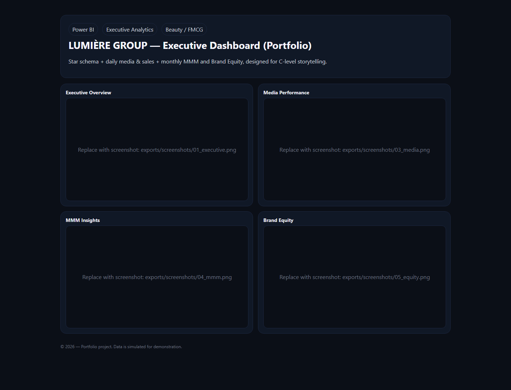

# Lumiere Portfolio Pack

Power BI executive analytics portfolio pack with synthetic data, data model, DAX/Power Query assets, theme, build guide, and a static showcase shell.

## Status

Portfolio pack. Synthetic/public-safe data is included. A hosted static showcase shell is available through GitHub Pages. Dashboard screenshots are still pending. License posture: all rights reserved / portfolio-use notice by default.

## What It Contains

- Data dictionary.
- Power BI build guide.
- DAX measures and power query transforms.
- Theme file.
- Static showcase shell for overview, media performance, MMM insights, and brand equity.
- Synthetic CSV data for portfolio demonstration.

## Proof

- Data safety: synthetic/public-safe data verified in the local proof record.
- Static showcase shell: `https://arochab.github.io/lumiere-portfolio-pack/`.
- Real site-shell screenshot: `docs/assets/lumiere-site-shell-screenshot-2026-06-02.png`.
- Power BI dashboard screenshots are pending for executive overview, media performance, MMM insights, and brand equity.

## Tech Stack

- Power BI.
- DAX.
- Power Query.
- Static HTML / CSS / JavaScript for the showcase site.

## Run Or View

- Open the Power BI build guide in `docs/`.
- Use the data dictionary to understand the synthetic dataset.
- View the hosted static showcase shell on GitHub Pages.
- Or open `site/index.html` locally.

## Notes

- This pack represents the design and structure of a portfolio, not a live data feed.
- The hosted showcase is a static shell, not an exported Power BI report.
- Screenshots must be exported from synthetic or approved public-safe data before they are added.
- Do not load private client data into the public pack.

## License

All rights reserved / portfolio-use notice by default. MIT or another reuse license should be added only if Adam explicitly approves public reuse of the data model, DAX, theme, and docs.
